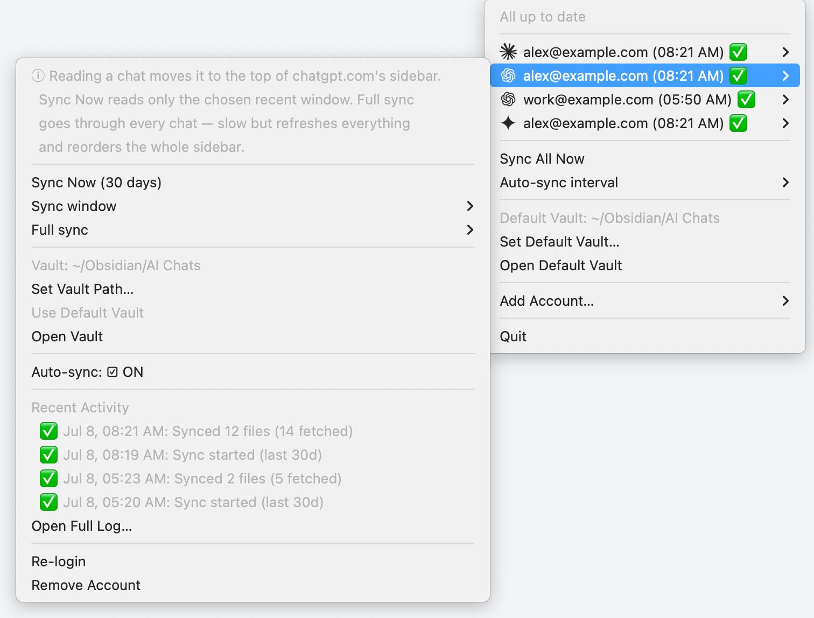

# Chativist

Chativist is a tray-only macOS app that archives your AI chat conversations
(Claude, ChatGPT, Gemini) into an Obsidian vault as Markdown. You log in to
each provider once inside an embedded browser window; Chativist keeps the
resulting session cookies locally and uses them to periodically pull your
conversations from each provider's own web API, converting them to Markdown
files in a vault folder you choose. There is no dock icon or main window —
everything is driven from the menu bar.



## Features

- **Multiple accounts per provider** — add as many Claude, ChatGPT, or
  Gemini accounts as you like; each is tracked separately by provider +
  email.
- **Per-account sync window (ChatGPT)** — choose how far back "Sync Now"
  looks (1 / 7 / 30 / 90 days, default 30) from each ChatGPT account's
  submenu.
- **Auto-sync interval** — a global background sync runs on a schedule you
  pick (every 30 min / 1h / 3h (default) / 6h / 12h / 24h).
- **Full sync (ChatGPT)** — an opt-in, one-shot pass that walks every
  conversation in a chosen order (by creation date or by last message time)
  to fully re-sort the chatgpt.com sidebar. Slower than a normal sync.
- **Markdown + raw JSON cache output** — each conversation is written to
  `{vault}/{provider}/{account}/{date}_{title}_{id}.md` with YAML
  frontmatter, and the provider's raw API response is cached alongside it at
  `{vault}/.chativist/cache/{provider}/{account}/{id}.json` (`{provider}` is
  `claude`, `chatgpt`, or `gemini`).
- **Menu bar controls** — per account: Sync Now / Stop Syncing, set a
  per-account vault or use the default, open the vault in Finder, toggle
  auto-sync, view recent activity, re-login, or remove the account. Globally:
  Sync All Now, the auto-sync interval, the default vault, and Add Account.

## Install

Download the latest signed and notarized DMG from
[GitHub Releases](https://github.com/combinatrix-ai/chativist/releases),
open it, and drag Chativist to Applications.

To run from source instead:

```sh
git clone https://github.com/combinatrix-ai/chativist.git
cd chativist
npm install
npm start
```

## Getting started

1. Click the Chativist icon in the menu bar and choose **Add Account...**,
   then pick a provider (Claude, ChatGPT, or Gemini).
2. A login window opens for that provider. Sign in as usual; the window
   closes itself once Chativist detects a valid session cookie.
3. The account appears in the menu right away and a first sync starts
   automatically. To change where its Markdown files go, use **Set Vault
   Path...** on the account's submenu, or leave it on the default vault
   (created at `~/chativist` the first time Chativist runs, or set your own
   via **Set Default Vault...**).
4. Use **Sync Now** on an account, or **Sync All Now** at the bottom of the
   menu, to sync on demand. Auto-sync also runs in the background on the
   configured interval.

## CLI

The packaged app can also run as a command-line tool, using the same
configured accounts and login sessions as the tray app (it does not open
login windows — re-login from the menu bar app if a session has expired):

```sh
/Applications/Chativist.app/Contents/MacOS/Chativist cli <command> [options]
```

Commands:

- `help` — print usage.
- `list` (alias `accounts`) — list configured accounts and their sync
  status. Add `--json` for machine-readable output.
- `sync` — sync selected accounts. Options: `--all`, `--include-disabled`,
  `--account <id>` (repeatable), `--provider <name>`, `--since-days <days>`,
  `--full-sync <created_at|last_message_at>`, `--json`.
- `mcp` — start the stdio MCP server (see below).

Examples:

```sh
/Applications/Chativist.app/Contents/MacOS/Chativist cli list
/Applications/Chativist.app/Contents/MacOS/Chativist cli sync --all
/Applications/Chativist.app/Contents/MacOS/Chativist cli sync \
  --account openai:user@example.com --since-days 7
```

When running from source, use `npm run cli -- <command> [options]`.

## MCP Server

Chativist can run as a stdio MCP server for local agents, reusing the app's
configured accounts and persisted login sessions. It does not open provider
login windows; re-login from the menu bar app if auth expired.

Project-scoped MCP client example, pointing at the packaged app:

```json
{
  "mcpServers": {
    "chativist": {
      "command": "/Applications/Chativist.app/Contents/MacOS/Chativist",
      "args": ["cli", "mcp"]
    }
  }
}
```

When running from source, use `npm run mcp` (equivalent to
`electron . cli mcp`) instead of the packaged binary.

The server exposes four tools:

- `ask` — ask a question through Chativist's persisted browser session. It
  currently supports ChatGPT accounts and returns `answer`, `conversationId`,
  `url`, `accountId`, and `provider`.
- `conversation` — fetch a full conversation by provider conversation id. It
  returns Markdown by default, and returns the provider raw JSON too when
  `includeRaw` is `true`.
- `accounts` — list configured accounts and sync status.
- `sync` — sync selected accounts to their configured Obsidian vaults.

It also exposes the `chativist://accounts` resource for configured accounts as
JSON.

Typical MCP flow:

```json
{
  "tool": "ask",
  "arguments": {
    "accountId": "openai:user@example.com",
    "prompt": "Review this design and point out the main risks.",
    "timeoutMs": 240000
  }
}
```

Then pass the returned `conversationId` to fetch the full transcript:

```json
{
  "tool": "conversation",
  "arguments": {
    "accountId": "openai:user@example.com",
    "conversationId": "123e4567-e89b-42d3-a456-426614174002"
  }
}
```

## Privacy / how it works

- All data stays on your machine — Markdown files and the raw JSON cache are
  written only into the vault folder you choose.
- "Logging in" stores your provider session cookies in an isolated Electron
  session partition per account, on disk under Chativist's app data
  directory. Chativist never sees or stores your password.
- There is no Chativist backend or external server. Syncing works by calling
  each provider's own internal web API (the same one their website uses)
  with your session cookie, on your behalf, to fetch your own conversations.

## Development

```sh
npm install
npm start
```

```sh
npm test        # node --test test/
npm run lint     # biome check src test
npm run knip     # find unused files/exports/dependencies
```

`electron-store` is pinned to 8.x because 9+ is ESM-only and this codebase is
CommonJS.

## Release (macOS)

Tag a version and CI handles the rest:

```sh
git tag v1.0.1
git push origin v1.0.1
```

GitHub Actions builds a universal binary, signs with the Developer ID cert,
notarizes via Apple, staples, and attaches the DMG + zip to a GitHub Release.

For local builds, the one-time CI setup, or troubleshooting see
[docs/release.md](docs/release.md).

For Mac App Store packaging and submission, see
[docs/mas-release.md](docs/mas-release.md).

## License

MIT — see [LICENSE](LICENSE).
